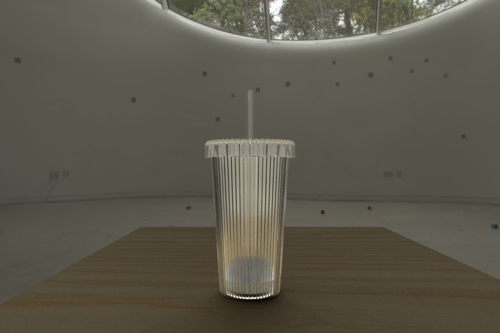
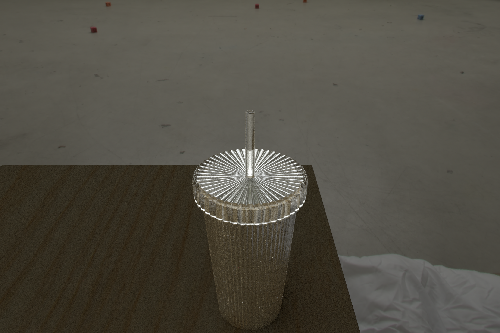

# Ribbed Glass Cup Renderman

Rendering course project for Computer Animation and Visual Effects Msc at Bournemouth University. I modelled the cup using the polygons in Python using the prman library for Renderman. The shaders for the cup for made using OSL.

